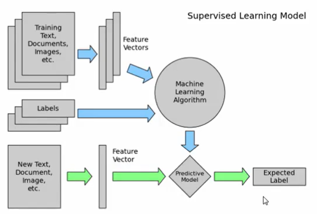

# Learn machine learning with scikit-learn

## two categories of machine learning

supervised learning: make predictions using data
unsupervised learning: extract structure from data

General terminology:

1. labeled data: data labeled with the outcome

high-level steps of supervised learning:

1. train a machine learning model using labeled data.
"machine learning model" learns the relationship between the attribute of the data and its outcome.
2. make predictions on new data for which label is unknown.

image representation:

## lesson 1 -- linear regression and gradient descent

1. correlation matrix

## lesson 2 -- logistic regression for classification

## lesson 3 -- decision trees and random forests

## lesson 4 -- approach ML projects

## lesson 5 --

## lesson 6 -- unsupervised machine learning
