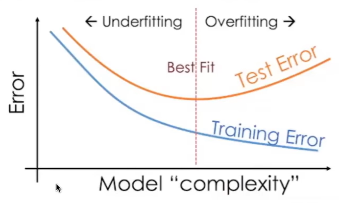

# Learn machine learning with scikit-learn

## two categories of machine learning

supervised learning: make predictions using data
unsupervised learning: extract structure from data

General terminology:

1. labeled data: data labeled with the outcome

high-level steps of supervised learning:

1. train a machine learning model using labeled data.
"machine learning model" learns the relationship between the attribute of the data and its outcome.
2. make predictions on new data for which label is unknown.

image representation:

machine learning core components

1. Model (regression, decision tree, etc.)
2. Cost function (how bad the model performs)
3. Optimizer (modify parameters to better fit the data)

Data preprocessing

1. drop NA rows (subset)
2. scaling (standard, minMax, etc)
3. imputation (fill missing values)
4. encoding (categorical columns)

## lesson 3 -- decision trees and random forests (4:52 ~ 7:22)

## lesson 4 -- approaches to ML projects (7:22 ~ 10:02)

## lesson 5 -- unsupervised learning (12:22 ~ 13:45)

## lesson 6 -- ML projects from scratch (13:45 ~ 16:35)
