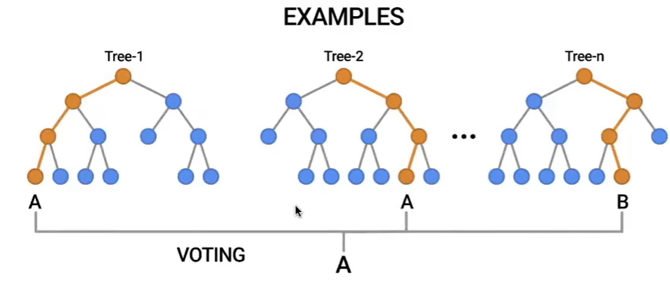

# Learn machine learning with scikit-learn

image representation:

machine learning core components

1. Model (regression, decision tree, etc.)
2. Cost function (how bad the model performs)
3. Optimizer (modify parameters to better fit the data)

Data preprocessing

1. drop NA rows (subset)
2. scaling (standard, minMax, etc)
3. imputation (fill missing values)
4. encoding (categorical columns)

Overfitting and Regularization

Random Forest concept

